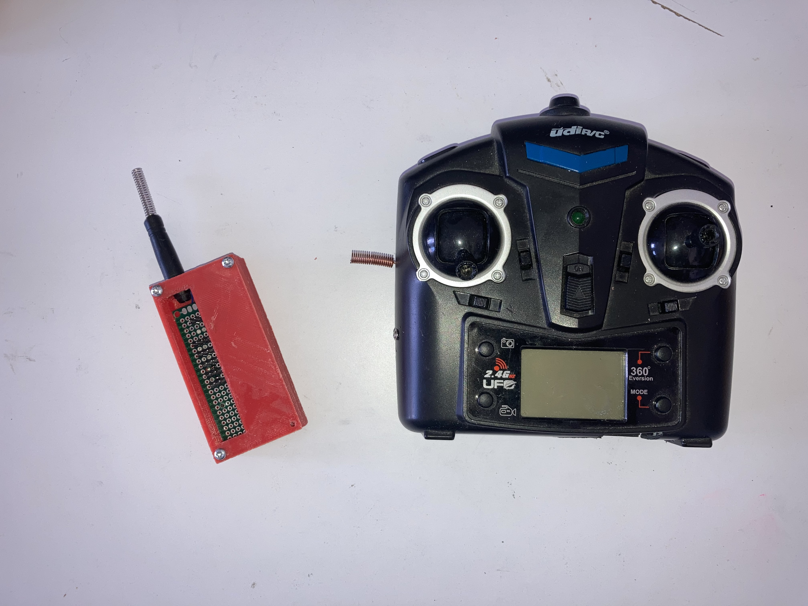
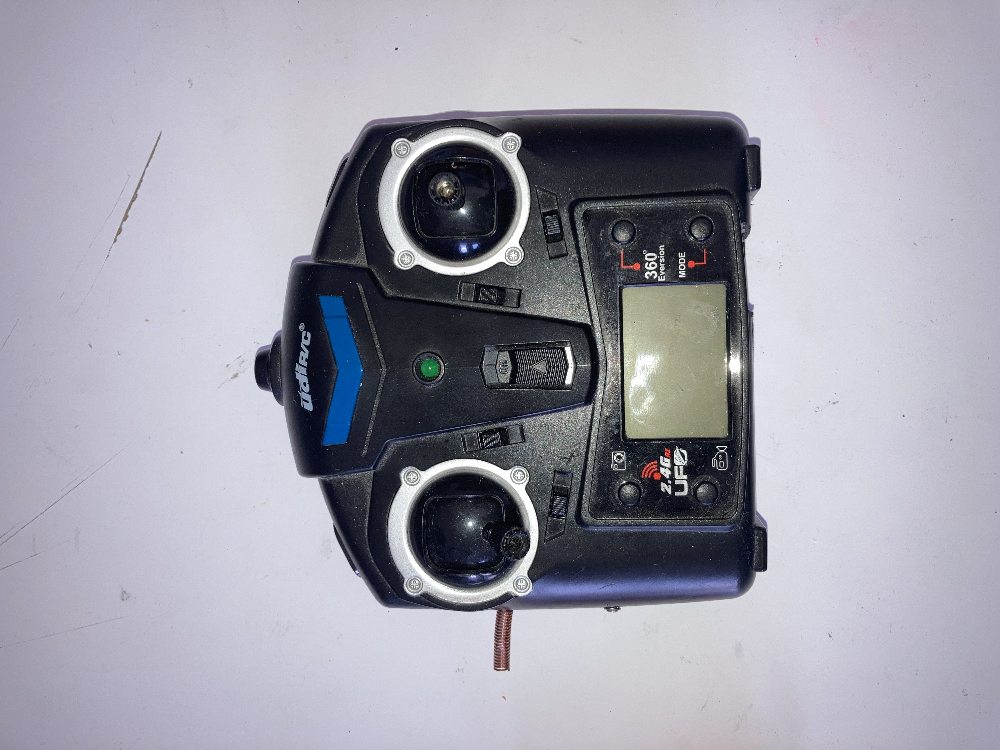
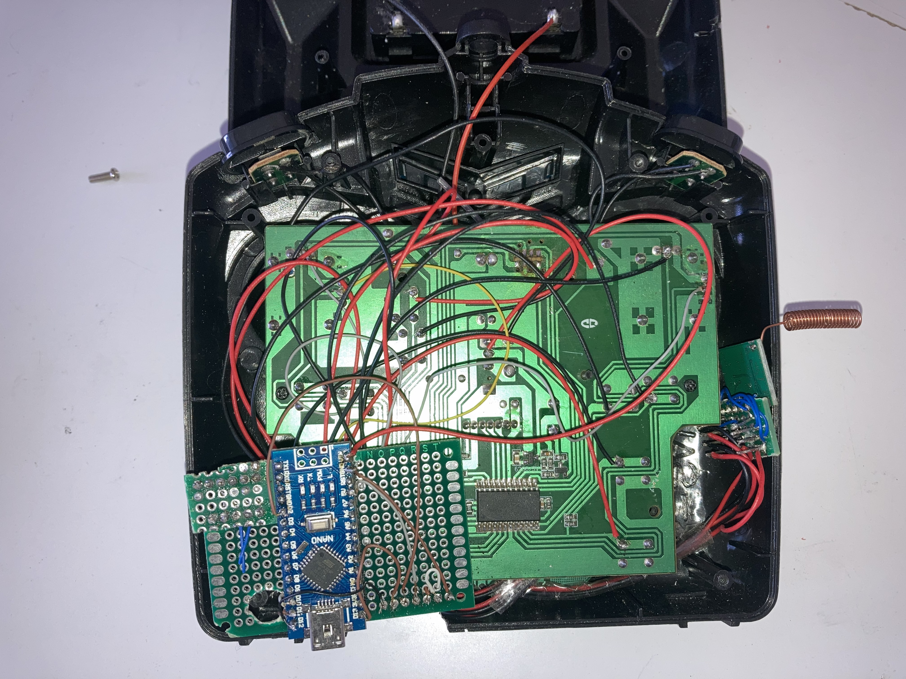
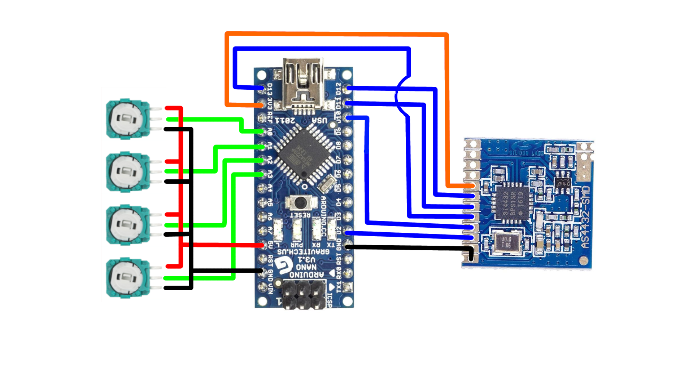
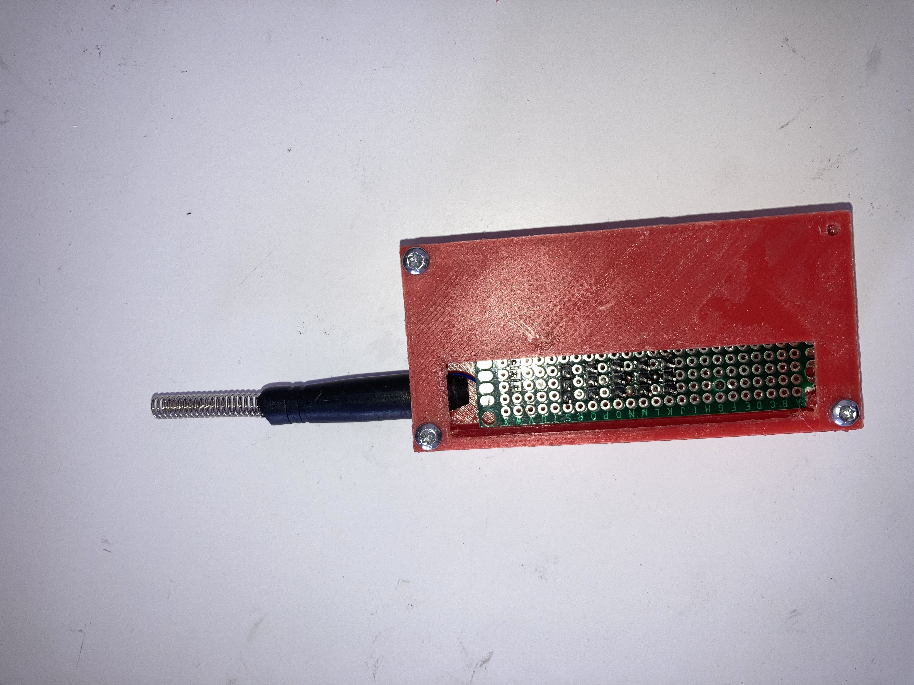
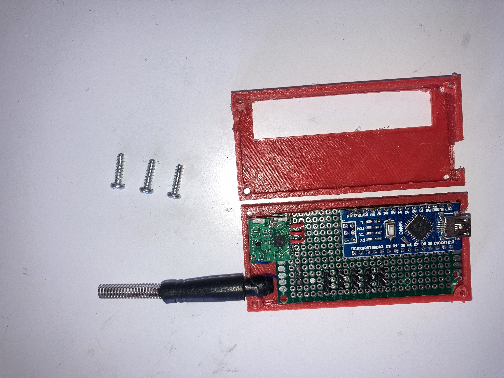
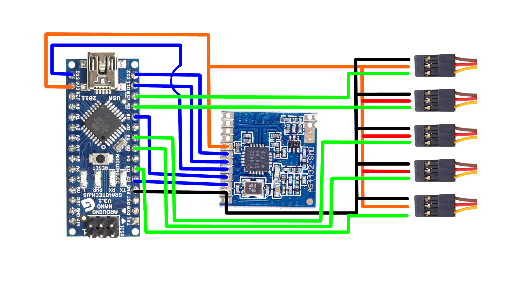

# drone-controller

This project is a Drone controller composed of a sender and receiver.

  
## Prerequisites
* RF22 arduino library: [http://www.airspayce.com/mikem/arduino/RF22](http://www.airspayce.com/mikem/arduino/RF22/)

## Controller
### Pictures

<table>
  <tr>
    <th>
      
    </th>
    <th>
      
    </th>
  </tr>
</table>

### Schematic

## Receiver
### Pictures

<table>
  <tr>
    <th>
      
    </th>
    <th>
      
    </th>
  </tr>
</table>

### Schematic

